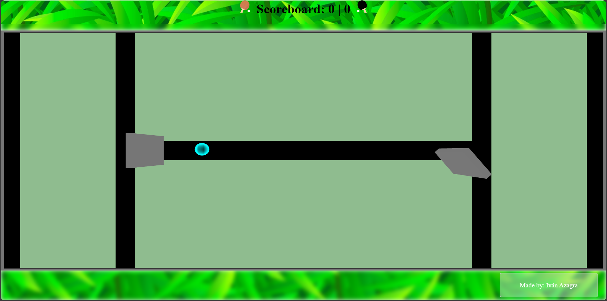

### Pong 3D

- A Pong game made with the Cannon physics engine to manage the movement of the paddles and the ball with the collisions between them.
- Using KeyboardControls to manage simultaneous presses so they don't cancel each other and let the paddles move without interruption.
- React_three-fiber for the 3D meshes used to display the game as the main renderer.

## Style
- Grass texture used in the Scoreboard taken from Freepik _and by Freepik_.
- Ball style made using Fresnel Shader, code on: https://github.com/otanodesignco/Fresnel-Shader-Material.git

## Images
- 

_The rotation of the paddles seemed funny so i letted it be like that, just randomness_

_Im aware the ball doesn't bounce depending on where the paddle faces but on its positive/negative rotation, im just tired of this, better let it be pretty and ok than perfect and ugly_

## Things remaining to do
- Loading Screen
- Changing the Box Mesh to a Character Mesh since its top-down view.
- Maybe fixing the value of the bounces making all rotations positive and depending on the returned number fixing directions.
- A useless reset button, nobody is gonna play that much.